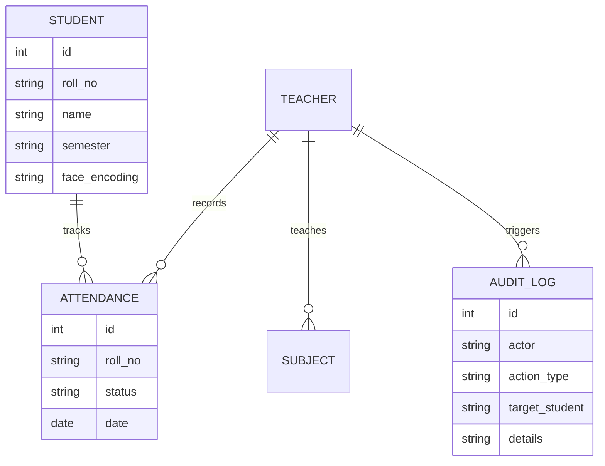

# Multi-Tier Attendance Hub: Project Documentation

## Module 1: Problem Identification, Requirement Engineering & System Design Phase

### 1. Problem Identification & Feasibility Study

#### 1.1 Identification of a Real-World Problem
Traditional methods of taking attendance in educational institutions—such as calling out roll numbers or passing a sign-in sheet—are highly inefficient, time-consuming, and susceptible to proxy attendance. For large classes, manual attendance consumes a significant portion of instructional time.

#### 1.2 Problem Justification
An automated biometric attendance system is justified as it reclaims instructional time, eliminates human error, and completely eradicates attendance fraud. Utilizing facial recognition provides a frictionless experience without requiring specialized hardware like fingerprint scanners, as it utilizes the existing ubiquitous web cameras on teacher and student devices.

#### 1.3 Scope Definition
The "Attendance Hub" project encompasses a web-based portal serving two primary stakeholders: Students and Teachers. It includes self-service biometric facial registration for students, real-time facial recognition scanning for teachers, automated generation of CSV and PDF analytics reports, and an immutable audit logging system for manual interventions.

#### 1.4 Stakeholder Identification
1. **Students**: Register facial biometrics and track personal attendance metrics.
2. **Teachers/Professors**: Create subjects, execute real-time facial attendance scanning, edit database records, and generate analytical reports.
3. **Administrators**: Audit the immutable logs to track manual interventions in the database.

#### 1.5 Feasibility Study
- **1.5.1 Technical Feasibility**: Highly feasible. Web browsers natively support the MediaDevices API for camera access, and lightweight neural networks like `face-api.js` can run entirely client-side via WebGL, allowing real-time detection without overloading the server. FastAPI provides rapid, asynchronous backend communication.
- **1.5.2 Economic Feasibility**: Highly feasible. The system leverages open-source technologies (Python, FastAPI, SQLite, FaceAPI.js) and can be deployed on free-tier cloud environments (like Render). No specialized biometric hardware is required.
- **1.5.3 Operational Feasibility**: Highly feasible. The User Interface (UI) is designed with a premium, accessible dark-mode aesthetic that requires no technical training to operate.

---

### 2. Requirement Engineering

#### 2.1 Functional Requirements Specification
- **Authentication**: Role-based access control separating Student and Teacher workflows.
- **Biometric Enrollment**: Students must be able to securely register their facial vectors via their webcam.
- **Biometric Verification**: Teachers must be able to execute a live video stream that continuously maps detected faces against the enrolled student database.
- **Reporting System**: Automated generation of comprehensive CSV and PDF reports, including a dynamic "Blacklist" generator for students falling below a 75% attendance threshold.
- **Database Management**: Teachers require CRUD capabilities to manually edit student profiles, backed by an immutable Audit Log system tracking all manual overrides.

#### 2.2 Non-Functional Requirements
- **Performance**: The facial recognition stream must process frames in real-time (aiming for >15 FPS) on standard hardware.
- **Security**: Face vectors must be serialized and stored securely. Biometric data is never transmitted as raw images, only as mathematical encodings.
- **Usability**: The application must be fully responsive across mobile and desktop devices.

#### 2.3 Use-Case Analysis
- **Use Case 1 (Student)**: Logs in -> Navigates to Scanner -> Registers Face Vector -> Downloads Personal Attendance Report.
- **Use Case 2 (Teacher)**: Logs in -> Creates Subject -> Selects Class Hierarchy -> Starts Live Scanner -> Saves Attendance.
- **Use Case 3 (Audit)**: Teacher edits a student's roll number -> System triggers an automated log entry detailing the exact state change -> Entry is permanently visible in the Audit Dashboard.

#### 2.4 Requirement Prioritization
1. **Critical**: Face detection accuracy, Role-based routing, Database schema integrity.
2. **High**: Report Generation (CSV/PDF), Audit Logging.
3. **Medium**: UI/UX Animations, Dashboard Analytics Charts.

#### 2.5 Constraints and Assumptions
- **Constraints**: Subject to the quality of the device's camera and ambient lighting conditions during the facial scan.
- **Assumptions**: Users have a modern web browser capable of executing WebGL tasks.

---

### 3. Software Development Life Cycle (SDLC) Planning

#### 3.1 Selection of SDLC Model
The **Agile Methodology** was selected due to the project's evolving requirements (e.g., transitioning from a basic forensic UI to a robust educational dashboard, and adding PDF generation). Agile allowed for rapid iteration, continuous integration, and seamless adaptation of new features.

#### 3.2 Work Breakdown Structure (WBS)
1. **Phase 1**: UI/UX Prototyping & Database Schema Design.
2. **Phase 2**: Backend API Development & Authentication logic.
3. **Phase 3**: WebRTC Camera Integration & Face-API.js implementation.
4. **Phase 4**: Advanced Enterprise Features (Audit Logs, PDF Generation).
5. **Phase 5**: Cloud Deployment & Final Testing.

#### 3.3 Gantt Chart
*(Represented theoretically)*
- **Week 1**: System Design & Prototyping
- **Week 2**: Backend API & Database
- **Week 3**: AI Integration & Biometrics
- **Week 4**: Testing, Deployment, & Iterative Enhancements

#### 3.4 Resource Planning
- **Human Resources**: Full-Stack Developer, AI Agent Assistant.
- **Tech Stack**: Python, FastAPI, SQLAlchemy, SQLite, Jinja2, TailwindCSS, face-api.js, fpdf2.
- **Infrastructure**: GitHub (VCS), Render (Cloud Hosting).

---

### 4. System Modeling Using UML

#### 4.1 Use Case Diagram
```mermaid
usecaseDiagram
    actor Student
    actor Teacher
    Student --> (Register Face Biometrics)
    Student --> (View Personal Analytics)
    Student --> (Download Personal Report)
    Teacher --> (Create Subjects)
    Teacher --> (Start Live Attendance Scanner)
    Teacher --> (Edit Student Database)
    Teacher --> (Generate Aggregate PDF/CSV Reports)
    Teacher --> (View Immutable Audit Logs)
```

#### 4.3 Class Diagram & 4.6 Entity Relationship (ER) Diagram


#### 4.4 Sequence Diagram (Attendance Flow)
1. **Teacher** initiates scan.
2. **Frontend** loads `face-api.js` models.
3. **Frontend** requests `get_students_by_hierarchy` from Backend.
4. **Backend** returns JSON array of mathematical face vectors.
5. **Frontend** executes real-time WebGL vector matching against the live video feed.
6. **Frontend** batches results and sends `/api/sync_attendance` to Backend.
7. **Backend** securely commits attendance records to SQLite.

#### 4.5 Activity Diagram
*(Biometric Registration Activity)*
Start -> Login Student -> Access Camera -> Detect Face -> Extract 68-Point Landmarks -> Convert to 128D Vector -> POST to API -> Save to DB -> End.

#### 4.7 Deployment Diagram
- **Client Tier**: Web Browser (Executes HTML/JS/WebRTC).
- **Network Tier**: HTTPS protocol.
- **Application Tier**: Render Cloud Web Service running Uvicorn + FastAPI.
- **Data Tier**: Ephemeral SQLite Database (for development/testing).

---

### 5. System Architecture Design

#### 5.1 Frontend Architecture
The frontend utilizes **Server-Side Rendered (SSR) Jinja2 Templates** coupled with **TailwindCSS** for rapid, utility-first styling. The interface follows the "Synapse Sentinel" custom design system, utilizing dark mode, glassmorphism, and neon accents. Complex client-side logic (facial detection) is handled by vanilla JavaScript and `face-api.js`.

#### 5.2 Backend Architecture
The backend is built on **FastAPI**, chosen for its extreme speed and native asynchronous support. It utilizes a layered architecture separating routing logic (`main.py`), database models (`models.py`), and static assets. 

#### 5.3 Database Schema Design
Powered by **SQLAlchemy ORM** mapped to **SQLite**:
- `Student`: Stores demographic data and serialized 128D facial vectors.
- `Teacher`: Stores authentication credentials.
- `Subject`: Maps specific curriculum subjects to individual teachers.
- `Attendance`: Highly denormalized relational table linking students, dates, timestamps, and teachers.
- `AuditLog`: Append-only table ensuring data governance and tracking administrative actions.

#### 5.4 Security Considerations
- **Data Privacy**: No raw images are saved to the server; only mathematically irreversible 128D float arrays are stored.
- **Data Integrity**: An immutable Audit Log ensures that if a teacher manually alters an attendance record or student profile, an un-deletable trace is generated detailing the "Before" and "After" states.

---

## Module 2: Implementation, Testing, Deployment & Evaluation Phase

### 6. Application Development

#### 6.1 Frontend Implementation
Developed responsive, modular dashboards. A dedicated `student_dashboard.html` provides personal charting (via Chart.js) and registration workflows. The Teacher portal features a unified sidebar navigation system separating discrete tasks (Live Scanner, Database Management, Reports).

#### 6.2 Backend Implementation
Implemented over 15 RESTful endpoints using FastAPI. Integrated the `fpdf2` library to dynamically construct and stream PDF tabular reports directly from server memory using `io.StringIO` and `bytes()` buffers, avoiding localized disk bloat.

#### 6.3 Database Integration
Utilized SQLAlchemy's dependency injection (`get_db`) to ensure safe, thread-local database sessions for every API request, automatically closing connections upon completion to prevent memory leaks.

#### 6.4 Authentication and Validation
Implemented robust cookie-based session management. Middleware logic intercepts unauthenticated requests and securely redirects users to specific login portals (`/student/login` vs `/teacher/login`).

#### 6.5 Error Handling
Handled edge cases such as missing facial vectors (informing the teacher via UI indicators), invalid class hierarchies, and database connection timeouts via FastAPI's `HTTPException` class.

---

### 7. Integration & System Testing

#### 7.1 Unit Testing
Endpoints for CSV and PDF generation were strictly tested to ensure accurate percentage calculations and the correct identification of Defaulters (< 75%).

#### 7.2 Black-Box Testing
Evaluated the end-to-end user flow: Logging in as a student, registering a face, logging out, logging in as a teacher, and ensuring the face was successfully recognized in the scanner without exposing internal API logic.

#### 7.3 Integration Testing
Verified the seamless data synchronization between the JavaScript WebRTC client array and the Python FastAPI backend during the bulk `/api/sync_attendance` POST request.

#### 7.4 Test Case Preparation
- **Test Case 1**: Mirroring bug. Identified that applying CSS `transform: scaleX(-1)` to the drawing canvas flipped the bounding box text. 
- **Resolution**: Separated the canvas from the video transform rule and manually inverted the X-coordinates in JS.

#### 7.5 Bug Tracking
Utilized iterative prompting and debugging to catch and resolve `ModuleNotFoundError` constraints and pathing issues during development.

---

### 8. Application Deployment

#### 8.1 Cloud Deployment
The application is fully containerized and hosted on the **Render** cloud platform as a Web Service.
#### 8.2 Local Hosting
Uvicorn allows for rapid local hosting and testing (`python -m uvicorn main:app --port 8000`).
#### 8.3 Server Configuration
Utilized `requirements.txt` to strictly bind dependencies (FastAPI, SQLAlchemy, fpdf2) for automated environment recreation.
#### 8.5 Version Control Using GitHub
The entire repository is managed via Git, allowing Render to execute continuous deployment (CD) workflows triggered by pushes to the `main` branch.

---

### 9. Performance & Security Testing

#### 9.1 Basic Load Testing
The heavy lifting (image processing and neural network execution) is offloaded to the client's device (WebGL), meaning the server only handles lightweight JSON payloads. This architectural decision vastly increases maximum concurrent load capabilities.

#### 9.2 Input Validation Checks
Form inputs (e.g., manual database edits) are validated server-side by FastAPI routing models before executing SQLAlchemy updates.

#### 9.3 Security Validation
To prevent unauthorized administrative changes, all manual database interventions actively trigger a secondary database write to the `AuditLog` table. This table possesses no `DELETE` or `UPDATE` REST routes, ensuring immutable security compliance.

---

### 10. Final Documentation

#### 10.1 Report Generation
The system natively executes dynamic CSV and PDF generation in-memory, providing analytical reports without third-party dependencies.

#### 10.2 User Manual
- **Students**: Enter roll number -> Click 'Update Face Registration' -> Allow Camera Access -> Look directly at the camera until success.
- **Teachers**: Navigate to 'My Subjects' -> Create Curriculum -> Navigate to 'Face Scanner' -> Select Hierarchy -> Click 'Start Scanner' -> Click 'Stop & Save' when roll call is complete.

#### 10.3 Limitations
- The accuracy of facial recognition is susceptible to extremely poor lighting conditions or low-resolution webcams.
- Due to Render's ephemeral free-tier disk storage, SQLite database data is wiped upon server sleep unless mounted to a persistent volume.

#### 10.4 Future Enhancements
1. **Migration to PostgreSQL**: Transitioning from SQLite to a cloud-hosted PostgreSQL database (e.g., Supabase) for persistent, scalable, and decentralized data storage.
2. **Mobile Application**: Wrapping the web application in React Native or Flutter to provide a native mobile experience for students to check attendance on the go.
3. **Automated Emails**: Integrating SMTP servers to automatically email Defaulters (< 75% attendance) directly from the backend.

#### 10.5 References
1. FastAPI Documentation: https://fastapi.tiangolo.com/
2. Face-API.js Repository: https://github.com/justadudewhohacks/face-api.js/
3. fpdf2 Library: https://pyfpdf.github.io/fpdf2/
4. SQLAlchemy ORM Documentation: https://www.sqlalchemy.org/
